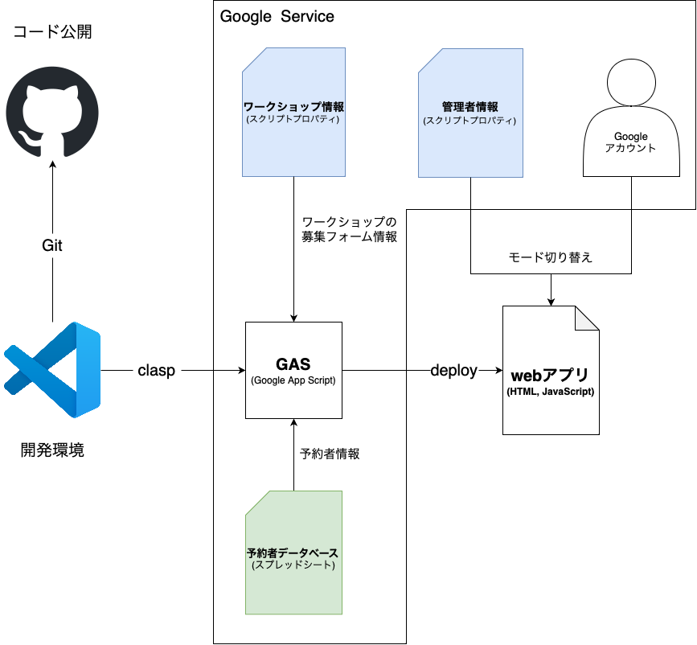

# AIM-SC ワークショップ予約システム

## 概要
開催予定のワークショップを一覧で確認でき、簡単に予約・キャンセルができるフォームアプリ

## URL
- [予約システム（デモ）](https://script.google.com/macros/s/AKfycbyAnBluPHYrX6RY7lADeC0DCnCzBTi4PElMXsmjeBbBttzsVXXY4yYOtpp_tsJGP8to/exec)[^browser][^user]
- [予約者情報DB（デモ）](https://docs.google.com/spreadsheets/d/14P-oIABdGodeiXzJ_KCYXiy8z7f30MnzrYaQwuBlq2c/edit?usp=sharing)

[^browser]: chrome推奨
[^user]: 青山学院大学に所属する学生を対象としているため、本来は大学から付与されたGoogleアカウントでのアクセスを想定している。そのため一般公開デモでは、<code>example@aoyama.jp</code>という擬似ユーザーでアクセスするようになっている。

## 目的
現在、青山学院大学附置情報メディアセンターに属するAIM Commonsでは、様々なワークショップを提供している。
今後より一層活発に企画していくために、利用者が容易に存在を知ることができ、申し込めるようなシステムの開発を目的とする。

## システム構成

## 使用技術
- サーバー：GoogleDrive, GoogleAppsScript
- ログイン機構：Google Workspace（Aoyama-mail）
- 表示：JavaScript, HTML, CSS
- デザインフレームワーク：Bootstrap5

## 機能一覧
<table>
	<thead>
		<tr>
			<th scope='col'></th>
			<th scope='col'>機能</th>
			<th scope='col'>詳細</th>
		</tr>
	</thead>
	<tbody>
		<tr>
			<td rowspan='4'>管理者画面</td>
			<td>新規フォームの作成</td>
			<td>
				画面中の<code>＋</code>ボタンから新規フォームを作成できる。
				作成されたフォームのカードは、<code>設定</code>ボタンからモーダルウィンドウが展開される。
				また、フォームには、ワークショップ開催のための必須項目を設定するモジュールがあらかじめ追加されている。
			</td>
		</tr>
		<tr>
			<td>フォームに質問モジュールの追加</td>
			<td>
				モーダルウィンドウ下部の、質問モジュール<code>追加</code>のボタンから、ドロップアップで追加可能な質問形式が表示され、対応する質問モジュールを追加できる。
			</td>
		</tr>
		<tr>
			<td>フォーム情報の保存</td>
			<td>
				モーダルウィンドウ下部の、<code>保存</code>ボタンから、フォームに追加・編集した情報を保存することができる。
			</td>
		</tr>
		<tr>
			<td>フォーム情報の削除</td>
			<td>
				モーダルウィンドウ下部の、<code>削除</code>ボタンから、フォームを削除することができる。
			</td>
		</tr>
		<tr>
			<td rowspan='2'>利用者画面</td>
			<td>募集中のワークショップの確認</td>
			<td>
				募集中のワークショップが、カード形式で一覧表示される。
				応募有無や定員、期日に応じたステータスをデザインで可視化。
			</td>
		</tr>
		<tr>
			<td>ワークショップへの予約（フォームへの回答）</td>
			<td>
				<code>詳細</code>から、概要などを確認し、フォームに回答できる。
				送信された回答は、検証にかけられ、回答に不足がある場合には、警告が表示される。
			</td>
		</tr>
		<tr>
			<td rowspan='2'>サーバーサイド</td>
			<td>終了したワークショップの自動削除</td>
			<td>
				ユーザーがアクセスした際、データベースからワークショップの募集情報を取得するとともに、終了したものについては、フォーム情報を削除する。
				注意として、フォーム情報は削除されるが、回答情報は削除されない（事後アンケート等、開催後の連絡のために）。
			</td>
		</tr>
		<tr>
			<td>管理者ステータスの変更</td>
			<td>
				<a href="https://docs.google.com/spreadsheets/d/14P-oIABdGodeiXzJ_KCYXiy8z7f30MnzrYaQwuBlq2c/edit?usp=sharing">予約者情報データベース</a>のメニューバーに追加した<code>管理者設定</code>から、管理パネルを開くことで、ユーザーへ権限の付与・変更ができる。
			</td>
		</tr>
	</tbody>
</table>

## 今後の実装予定
- 予約・キャンセル受付メールの自動送信
- 前日リマインダーや事後アンケートメールといった諸連絡ツールの実装
- キャンセル待ちの実装
